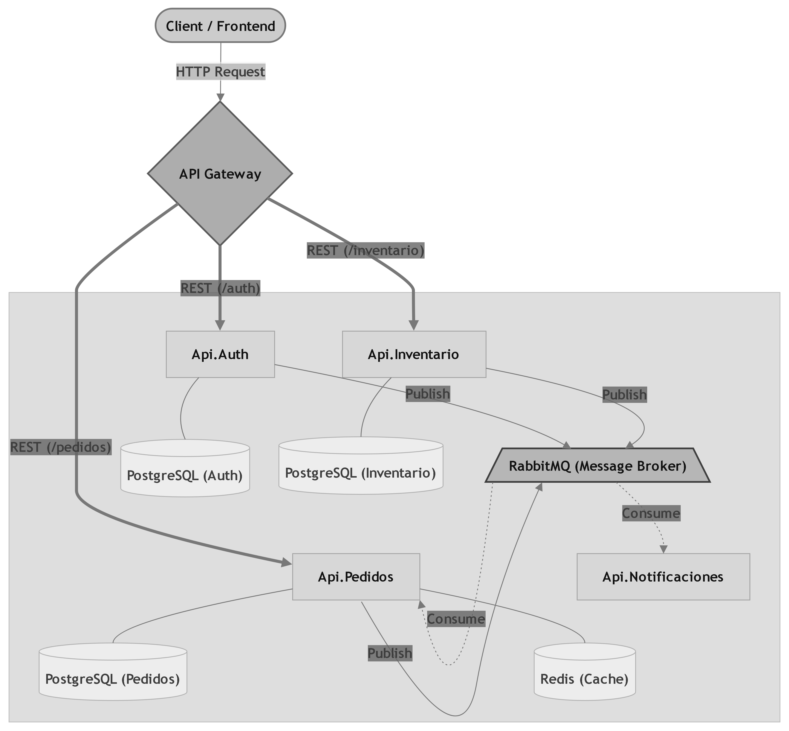

#  Documentación de Arquitectura: E-Commerce 

## 1. Introducción
Este documento detalla el diseño de software y la infraestructura subyacente del sistema de E-Commerce. El proyecto ha sido concebido bajo un paradigma de **Microservicios distribuidos**, diseñado para resolver los desafíos comunes de escalabilidad, mantenibilidad y aislamiento de dominios de negocio.

A diferencia de una arquitectura monolítica tradicional, este sistema se basa en el principio de **desacoplamiento total**. Cada microservicio es un *Bounded Context* (Contexto Acotado) autónomo, que posee su propia base de datos, lógica de dominio y ciclo de vida, permitiendo que el sistema evolucione de manera ágil sin efectos colaterales inesperados.

---

## 1.2 Visión General del Sistema

  

El núcleo del sistema es un **Ecosistema Orientado a Eventos (Event-Driven Architecture)**. 

El flujo de información no se basa en llamadas síncronas (HTTP/REST) entre servicios, lo cual causaría una alta dependencia y puntos únicos de fallo. En su lugar, el sistema utiliza un **Message Broker (RabbitMQ)** para facilitar la comunicación asíncrona mediante el patrón **Pub/Sub (Publish/Subscribe)**.

### Objetivos Principales:
*   **Alta Disponibilidad:** Si el servicio de notificaciones cae, el servicio de pedidos sigue operando normalmente y los eventos quedan encolados para su procesamiento posterior.
*   **Consistencia Eventual:** Se prioriza la disponibilidad y la escalabilidad, asegurando que el estado del sistema converja hacia la consistencia a través de la propagación de eventos.
*   **Independencia Tecnológica:** Cada servicio tiene la autonomía para escalar sus recursos según la carga de trabajo específica que reciba.

---

## 1.3 Filosofía de Diseño
El diseño de este proyecto se rige por tres pilares fundamentales:

1.  **Autonomía de Datos:** Cada servicio posee su propia persistencia (PostgreSQL). No existen consultas cruzadas entre bases de datos; la comunicación ocurre exclusivamente a través de los eventos definidos en el contrato compartido (`SharedContracts`).
2.  **Transacciones Distribuidas (Patrón Saga):** Dado que no podemos utilizar transacciones ACID tradicionales entre microservicios, el sistema implementa una **Saga Coreografiada**. Los servicios colaboran emitiendo eventos de éxito o compensación ante fallos (ej: *StockRechazadoEvent*), manteniendo la integridad del proceso de compra.
3.  **Comunicación Contratada:** El uso de **MassTransit** sobre RabbitMQ nos permite definir contratos fuertemente tipados. Esto garantiza que cualquier cambio en la estructura de un mensaje sea detectado en tiempo de compilación, minimizando errores en tiempo de ejecución.

---

## 1.4 Alcance y Consideraciones del Proyecto

Para la correcta evaluación de este repositorio, es importante tener en cuenta las siguientes consideraciones respecto a su desarrollo:

*   **Enfoque Arquitectónico vs. Funcionalidad Completa:** Al tratarse de un proyecto con fines de aprendizaje y demostración técnica, el esfuerzo se ha centrado exclusivamente en resolver problemas complejos de ingeniería (transacciones distribuidas, mensajería asíncrona, despliegue con Docker). Por este motivo, se han omitido intencionalmente endpoints de soporte comunes en aplicaciones en producción (ej. *recuperación de contraseña en Auth, gestión de perfiles de usuario, etc.*), ya que no aportan valor adicional a la demostración de la arquitectura base.
*   **Asistencia de Inteligencia Artificial:** Durante el ciclo de vida del desarrollo, se utilizaron herramientas de Inteligencia Artificial (LLMs) como asistentes de productividad. Su uso se limitó a tareas como la generación de código *boilerplate*, maquetado rápido de esta documentación y resolución de dudas de sintaxis. **Todas las decisiones arquitectónicas, el modelado de dominios, la elección de patrones de diseño y la topología del sistema fueron analizadas, diseñadas y aplicadas de forma 100% humana.**

---

  <b><a href="./02-saga-rabbitmq.md">Siguiente: Patrón Saga y Message Broker </a></b>

