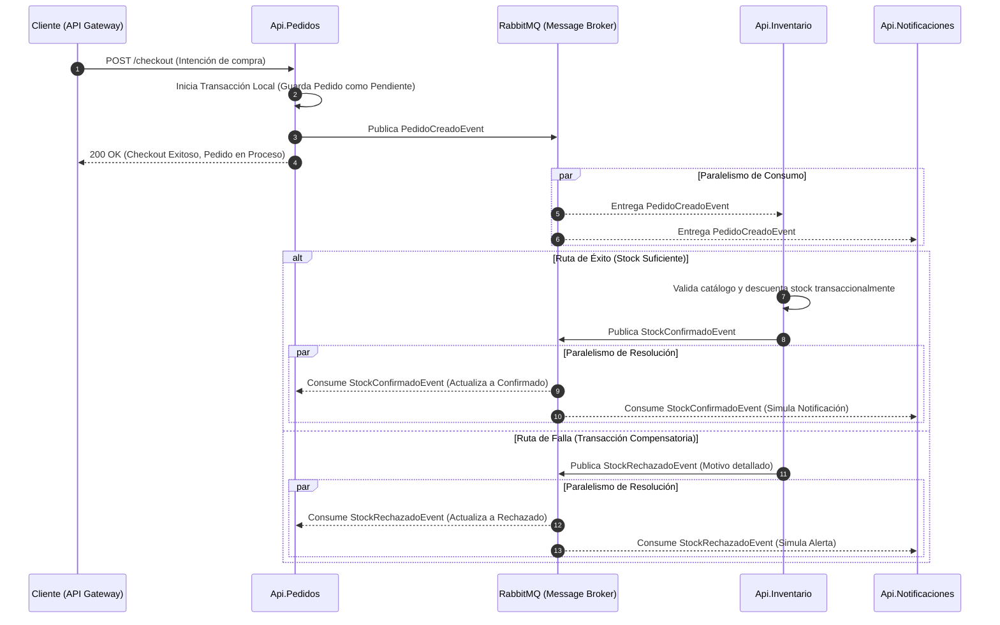

# 2. Arquitectura Orientada a Eventos y Patrón Saga

En una aplicación monolítica tradicional, las operaciones complejas (como cobrar, descontar stock y generar un pedido) se resuelven mediante transacciones de base de datos tradicionales (ACID). Si un paso falla, el motor de base de datos ejecuta un `rollback` automático.

En una arquitectura de microservicios, este paradigma se rompe. Cada dominio posee su propia base de datos aislada, imposibilitando las transacciones centralizadas. Para resolver este desafío de consistencia de datos distribuida, el ecosistema implementa el **Patrón Saga** apoyado en una **Arquitectura Orientada a Eventos (EDA)**.

---

## 2.1 Componentes del Ecosistema

Para habilitar esta comunicación distribuida, la arquitectura se apoya en los siguientes pilares tecnológicos:

* **YARP (API Gateway):** Actúa como el enrutador central. Recibe todas las peticiones del cliente (Frontend) en un único punto de entrada y las redirige de forma invisible hacia las redes internas de los microservicios correspondientes. El cliente jamás interactúa directamente con los dominios internos ni con el bus de mensajes.
* **SharedContracts:** Funciona como el "idioma universal". Dado que los microservicios no comparten código ni bases de datos, utilizan esta librería transversal para conocer la estructura y firma exacta de los eventos sin acoplarse directamente entre sí.
* **Productores y Consumidores:** Los servicios asumen roles dinámicos. Por ejemplo, `Api.Pedidos` actúa como Productor al publicar un `PedidoCreadoEvent`, mientras que `Api.Inventario` actúa como Consumidor al mantener un proceso de escucha activa (Listener) sobre la red.
* **MassTransit + RabbitMQ:** El Message Broker. Constituye el canal de comunicación asíncrona que retiene y distribuye los mensajes entre los dominios, garantizando la entrega.

---

## 2.2 Justificación Arquitectónica: Coreografía vs. Orquestación

El Patrón Saga ejecuta una secuencia de transacciones locales coordinadas. Para este proyecto, se ha descartado el modelo de Orquestación en favor de la **Coreografía**.

### Por qué se descartó la Orquestación
En la orquestación, un componente central coordina cada paso (llama al servicio A, espera respuesta, llama al servicio B). Bajo altos volúmenes de tráfico, este orquestador se convierte en un **cuello de botella** y un **Single Point of Failure (SPOF)**. Si el orquestador se satura, colapsa toda la operatoria del negocio, perdiendo el desacoplamiento que la arquitectura de microservicios busca solucionar.

### Ventajas de la Coreografía (El enfoque elegido)
En la Coreografía, no existe un coordinador central. Cada microservicio es completamente autónomo: reacciona a los eventos que le interesan, ejecuta su lógica de dominio y emite un nuevo evento al sistema.
* **Resiliencia Total (Tolerancia a Particiones):** Si el microservicio de Inventario sufre una caída, `Api.Pedidos` continúa operando con normalidad. Los eventos de nuevas compras no se pierden; RabbitMQ los retiene en cola. Cuando Inventario restablece su servicio, consume y procesa todos los mensajes acumulados, garantizando consistencia eventual sin pérdida de datos.
* **Desacoplamiento Máximo:** Los servicios no necesitan conocer la existencia de los demás, facilitando la escalabilidad horizontal independiente.

### Trade-offs (Desventajas asumidas)
El desafío principal de la Coreografía es la pérdida de visibilidad del flujo transaccional. Al no existir un controlador central, rastrear en qué estado quedó una petición compleja requiere de estrategias de observabilidad maduras, como la implementación de trazabilidad distribuida (OpenTelemetry).

---

## 2.3 El Flujo de Compra (Checkout Saga)

El proceso de checkout ilustra la delegación de responsabilidades mediante eventos.

### Diagrama de Secuencia

---

## 2.4 Resiliencia Adicional y Manejo de Errores

Para robustecer la red de coreografía, la integración con MassTransit incluye:
* **Dead Letter Queues (DLQ):** Si un evento falla repetidamente al ser consumido (por errores lógicos o datos corruptos), el mensaje se traslada a una cola de errores. Esto previene el bloqueo del flujo principal y retiene el payload para auditoría.
* **Idempotencia:** Los consumidores (como `StockConfirmadoConsumer`) verifican el estado persistido de la entidad antes de aplicar mutaciones, previniendo duplicaciones de estado ante entregas repetidas del Message Broker (At-Least-Once Delivery).

| [ Anterior: Introduccion](./01-introduccion.md) | 
<b>[Siguiente: Componentes ](./03-componentes.md)</b>
 |
| :--- | :--- |