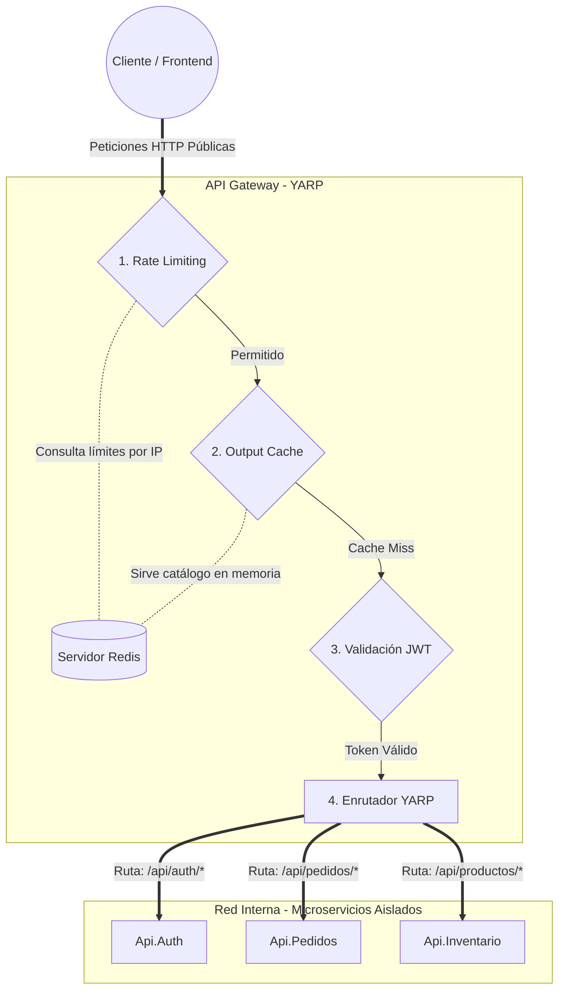

# 3. Detalle de Componentes

En esta sección se desglosan los elementos principales que conforman la topología de la red y el ecosistema de microservicios, comenzando por el punto de entrada principal del sistema.

## 3.1 API Gateway (YARP)

En una arquitectura de microservicios, exponer cada servicio directamente al cliente (Frontend o Aplicación Móvil) genera múltiples problemas: acoplamiento de URLs, exposición de la red interna y dificultad para implementar políticas de seguridad globales. 

Para resolver esto, el sistema implementa un **API Gateway** (configurado mediante **YARP - Yet Another Reverse Proxy**), que actúa como el único punto de entrada público para todo el tráfico externo y centraliza las reglas de seguridad, caché y enrutamiento.

### Responsabilidades y Diseño del Gateway:

1. **Enrutamiento Inverso (Reverse Proxy):** Recibe todas las peticiones HTTP del cliente y las redirige al microservicio correspondiente dentro de la red interna. El cliente solo conoce la URL del Gateway, ignorando por completo la topología interna.
2. **Autenticación y Autorización Centralizada:** Actúa como el primer gran filtro de seguridad del sistema verificando el token JWT emitido por `Api.Auth`. Valida los roles del usuario de forma centralizada; por ejemplo, restringe los endpoints de mutación de productos (POST, PUT, DELETE) exclusivamente a la política `AdminOnly`.
3. **Seguridad y Rate Limiting Distribuido (Redis):** Se desarrolló un middleware personalizado para gestionar el límite de peticiones (20 peticiones por minuto por IP). Al utilizar **Redis** en lugar de memoria RAM local, el Rate Limiter es "distribuido". Si el Gateway escala horizontalmente a múltiples instancias, el límite se mantiene global, protegiendo a los microservicios internos contra ataques DDoS y fuerza bruta.
4. **Caché de Salida Distribuida (Output Caching):** Mejora drásticamente los tiempos de respuesta interceptando peticiones frecuentes. Las consultas públicas al catálogo de productos (`GET /api/productos`) son servidas directamente desde la memoria de caché en Redis (configurada con un TTL de 60 segundos), evitando sobrecargar el microservicio de Inventario y su base de datos.

### Diseño del Pipeline de Middlewares (Fail-Fast)
El orden de ejecución está diseñado bajo el principio de "falla rápido". El middleware de Rate Limiting se ejecuta primero, rechazando el tráfico malicioso inmediatamente (HTTP 429). Esto evita desperdiciar ciclos de CPU validando firmas criptográficas de tokens JWT de peticiones que de todas formas iban a ser bloqueadas.

<b>Ver Diagrama de Flujo y Topología de Red</b>

---

| <b><a href="./02-saga-rabbitmq.md">Anterior: Patrón Saga y Message Broker</a></b> | <b><a href="./04-microservicios.md">Siguiente: Microservicios y Dominios</a></b> |
| :--- | ---: |