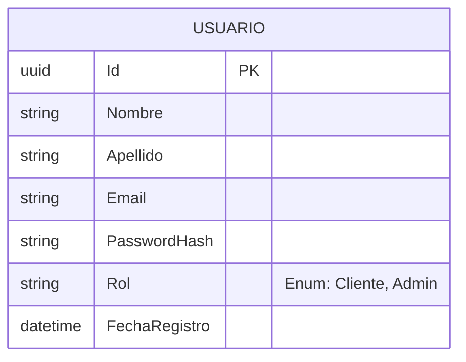
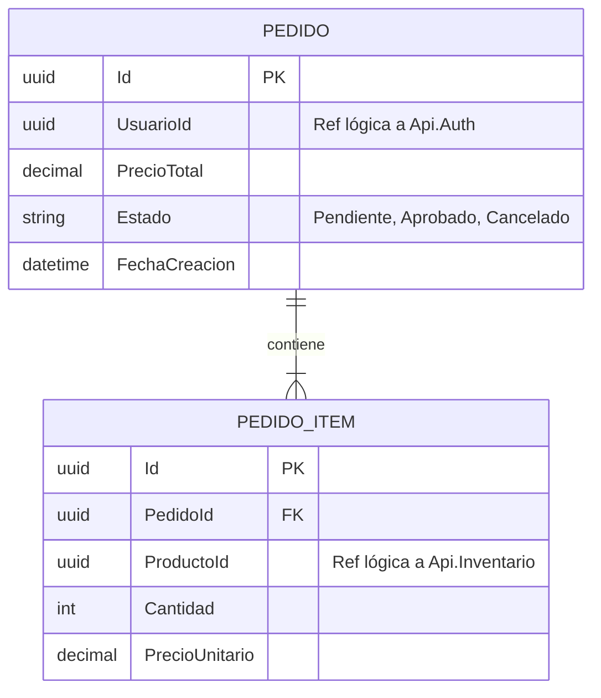
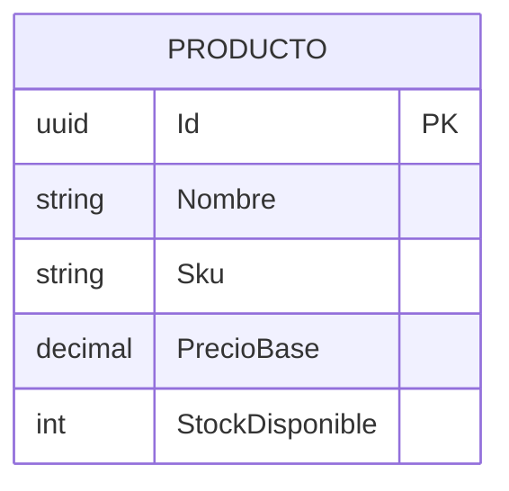
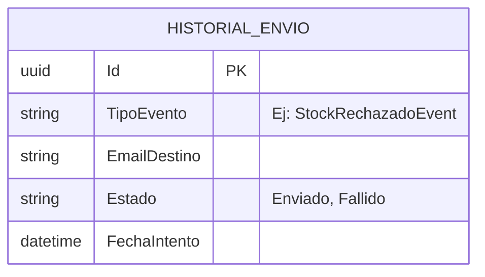

#  3. Microservicios y Dominios de Negocio

El sistema está compuesto por cuatro microservicios principales. Cada uno representa un **Bounded Context** aislado, con su propia lógica de negocio, reglas de dominio y base de datos autónoma, respetando el patrón *Database-per-Service*.

> **Nota Arquitectónica Global:** Todos los microservicios de este ecosistema han sido diseñados internamente siguiendo los principios de **Clean Architecture**. Esto garantiza una separación estricta de responsabilidades (Domain, Application, Infrastructure y Presentation), manteniendo las reglas de negocio completamente agnósticas a los detalles de implementación (como Entity Framework o MassTransit).

---

## 3.1 Api.Auth (Identidad y Accesos)

Es el único servicio encargado de conocer las credenciales de los usuarios. Ningún otro servicio tiene acceso a las contraseñas ni a los datos sensibles de autenticación.

* **Responsabilidades:** Registro de usuarios, validación de credenciales y generación de tokens JWT.
* **Seguridad:** El hasheo de contraseñas se realiza utilizando el algoritmo **BCrypt**. Como regla de negocio de dominio, durante el registro se valida primero que el correo electrónico no exista en el sistema; solo si está disponible, se procede a hashear la contraseña y persistir la entidad.
* **Base de Datos:** PostgreSQL.
* **Eventos:**
  * **Publica:** `UsuarioRegistradoEvent` (Para disparar procesos de bienvenida u onboarding en otros dominios, como enviar un email de bienvenida).

<b>Ver Diseño de Base de Datos (Api.Auth)</b>

> **Nota:** La tabla `USUARIO` es la dueña del perfil de identidad. Su `Id` será utilizado como referencia lógica en el resto del ecosistema (ej. en Api.Pedidos).

---

## 🛒 3.2 Api.Pedidos (Gestión de Órdenes)
Es el "corazón" transaccional del cliente. Maneja la intención de compra y orquesta el flujo inicial del negocio.

*   **Responsabilidad:** Administración de carritos de compra y generación de la orden de pedido (Checkout).
*   **Base de Datos:** PostgreSQL (Persistencia de órdenes) y Redis (Caché temporal para los carritos activos).
*   **Eventos:**
    *   📤 **Publica:** `PedidoCreadoEvent` (Inicia la Saga de validación).
    *   📥 **Consume:** `StockConfirmadoEvent` / `StockRechazadoEvent` (Actualiza el estado final del pedido).

<b>👉 Ver Diseño de Base de Datos (Api.Pedidos)</b>

> **Nota de Arquitectura:** Observar que `UsuarioId` y `ProductoId` son **referencias lógicas** (GUIDs) y no Foreign Keys estrictas. Esto garantiza el desacoplamiento físico con las bases de datos de Auth e Inventario.

---

## 📦 3.3 Api.Inventario (Control de Stock)
La fuente de la verdad absoluta sobre la disponibilidad física de los productos. 

*   **Responsabilidad:** Mantener el catálogo y evaluar la viabilidad de un pedido descontando el stock disponible.
*   **Base de Datos:** PostgreSQL.
*   **Eventos:**
    *   📥 **Consume:** `PedidoCreadoEvent` (Evalúa si hay existencias para satisfacer la orden).
    *   📤 **Publica:** `StockConfirmadoEvent` (Si hay stock suficiente) o `StockRechazadoEvent` (Si falta stock, disparando la transacción compensatoria en Pedidos).

<b>👉 Ver Diseño de Base de Datos (Api.Inventario)</b>

---

## ✉️ 3.4 Api.Notificaciones (Canal de Alertas)
Un servicio satélite diseñado puramente para reaccionar a los cambios de estado del ecosistema y notificar al cliente.

*   **Responsabilidad:** Desacoplar el envío de emails (u otras alertas) del flujo principal. Si el proveedor de correos falla, los eventos quedan retenidos en el Message Broker garantizando que no se pierdan.
*   **Base de Datos:** PostgreSQL (Historial de envíos).
*   **Eventos:**
    *   📥 **Consume:** `UsuarioRegistradoEvent`, `PedidoCreadoEvent`, `StockRechazadoEvent`, `StockConfirmadoEvent`.

<b>👉 Ver Diseño de Base de Datos (Api.Notificaciones)</b>

> **Nota:** Este servicio almacena un log inmutable de notificaciones enviadas, ideal para auditorías y reintentos ante fallas del proveedor SMTP.

---

| [ Anterior: API Gateway](./02-componentes.md) | 
<b>[Siguiente: Patrón Saga y Message Broker ](./04-saga-rabbitmq.md)</b>
 |
| :--- | :--- |