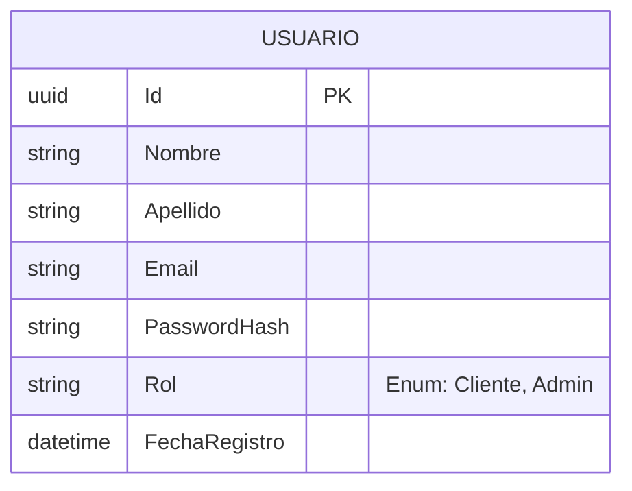
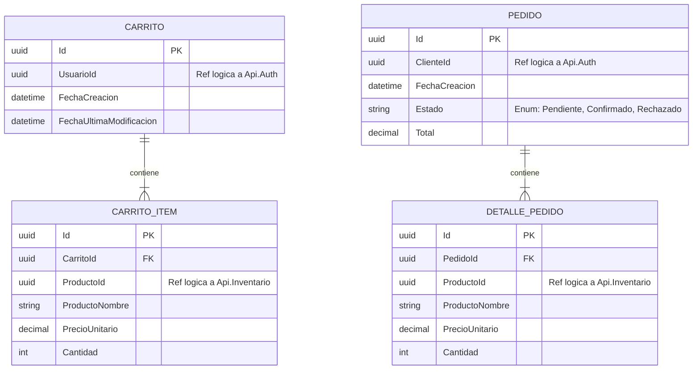
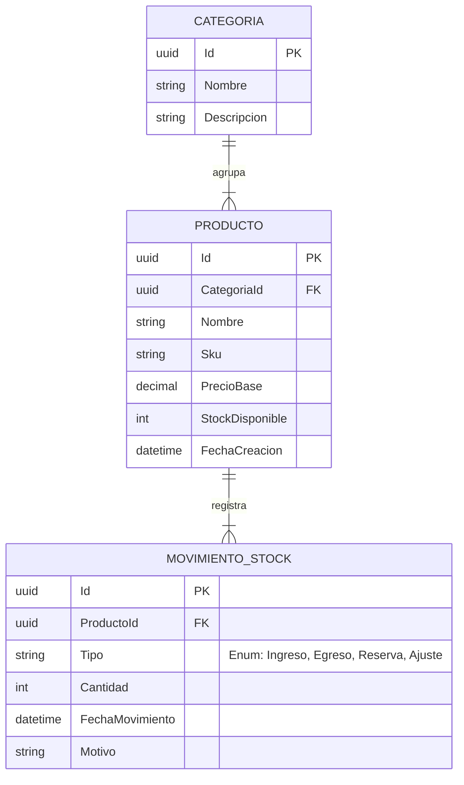

# 4. Microservicios y Dominios de Negocio

El sistema está compuesto por cuatro microservicios principales. Cada uno representa un **Bounded Context** aislado, con su propia lógica de negocio, reglas de dominio y base de datos autónoma, respetando el patrón *Database-per-Service*.

> **Nota Arquitectónica Global:** Todos los microservicios de este ecosistema han sido diseñados internamente siguiendo los principios de **Clean Architecture**. Esto garantiza una separación estricta de responsabilidades (Domain, Application, Infrastructure y Presentation), manteniendo las reglas de negocio completamente agnósticas a los detalles de implementación (como Entity Framework o MassTransit).

## 4.1 Api.Auth (Identidad y Accesos)

Es el único servicio encargado de conocer las credenciales de los usuarios. Ningún otro servicio tiene acceso a las contraseñas ni a los datos sensibles de autenticación.

* **Responsabilidades:** Registro de usuarios, validación de credenciales y generación de tokens JWT.
* **Seguridad:** El hasheo de contraseñas se realiza utilizando el algoritmo **BCrypt**. Como regla de negocio de dominio, durante el registro se valida primero que el correo electrónico no exista en el sistema; solo si está disponible, se procede a hashear la contraseña y persistir la entidad.
* **Base de Datos:** PostgreSQL.
* **Eventos:**
  * **Publica:** `UsuarioRegistradoEvent` (Para disparar procesos de bienvenida u onboarding en otros dominios, como enviar un email de bienvenida).

<b>Ver Diseño de Base de Datos (Api.Auth)</b>

> **Nota:** La tabla `USUARIO` es la dueña del perfil de identidad. Su `Id` será utilizado como referencia lógica en el resto del ecosistema (ej. en Api.Pedidos).

## 4.2 Api.Pedidos (Gestión de Órdenes y Carritos)

Es el núcleo transaccional del cliente. Maneja la persistencia temporal de los carritos de compra, orquesta la intención de adquisición (Checkout) y mantiene el histórico inmutable de los pedidos.

* **Responsabilidades:** 
  * Administración del ciclo de vida del carrito (asociación automática al registrarse el usuario, alta y modificación de ítems).
  * Orquestación del proceso de checkout y emisión de la intención de compra.
  * Transición de estados de pedidos mediante la consumición de eventos asíncronos y vaciado preventivo del carrito.
* **Seguridad y Resiliencia:**
  * Implementación de **Rate Limiting** (patrón *Fixed Window*) en el endpoint de Checkout para mitigar posibles abusos, spam de solicitudes o errores de frontend, protegiendo así al bus de mensajes (RabbitMQ) de una saturación por exceso de eventos.
  * Validación de tokens JWT interna (Zero Trust) para asegurar que cada acción sobre el carrito esté estrictamente vinculada a la identidad verificada del usuario.
* **Flujo Transaccional y Reglas de Negocio:**
  1. **Inicialización:** Al registrarse un usuario en el sistema, se crea su respectivo carrito de compras vinculado a su identificador de usuario.
  2. **Checkout:** Al confirmar el carrito, se genera un registro en la tabla de pedidos con estado inicial `Pendiente` y se emite el evento `PedidoCreadoEvent`.
  3. **Resolución Asíncrona:** El microservicio escucha los eventos de respuesta emitidos por `Api.Inventario` (`StockConfirmadoEvent` o `StockRechazadoEvent`).
  4. **Persistencia Histórica y Limpieza:** Tanto si el stock fue confirmado como si fue rechazado, se ejecuta la limpieza de los ítems del carrito activo. El pedido y sus detalles permanecen almacenados con su estado final (`Confirmado` o `Rechazado`) a modo de registro histórico y auditoría.
* **Base de Datos:** PostgreSQL.
* **Eventos:**
  * **Publica:** `PedidoCreadoEvent` (Inicia la validación de disponibilidad en el inventario).
  * **Consume:** `UsuarioRegistradoEvent` (Para la creación asíncrona del carrito inicial).
  * **Consume:** `StockConfirmadoEvent` / `StockRechazadoEvent` (Actualiza el estado de la orden a Confirmado o Rechazado).

<b>Ver Diseño de Base de Datos (Api.Pedidos)</b>

> **Nota de Arquitectura:** `UsuarioId`, `ClienteId` y `ProductoId` actúan como **referencias lógicas** (GUIDs) y no como Foreign Keys directas en base de datos, garantizando el aislamiento físico y respetando los límites de contexto (Bounded Contexts) frente a los microservicios de Auth e Inventario.

## 4.3 Api.Inventario (Catálogo y Control de Stock)

Constituye la fuente de verdad absoluta sobre la disponibilidad física de los productos y la estructura del catálogo. Este microservicio está diseñado con un enfoque de administración centralizada, sirviendo como el backend principal para el backoffice corporativo.

* **Responsabilidades:** 
  * Administración integral del catálogo (alta, baja y modificación de productos y categorías), restringida exclusivamente a usuarios con rol de `Administrador`.
  * Registro inmutable de entradas y salidas mediante un registro de `MovimientoStock`, asegurando la trazabilidad de cada unidad.
  * Evaluación en tiempo real de la viabilidad de un pedido, descontando o reservando el stock disponible de manera transaccional (implementando el patrón Unit of Work).
* **Seguridad:**
  * Validación interna de tokens JWT con políticas de autorización basadas en roles (RBAC). Las mutaciones del catálogo exigen privilegios administrativos, protegiendo los endpoints estratégicos bajo estricto control de acceso.
* **Base de Datos:** PostgreSQL.
* **Eventos:**
  * **Consume:** `PedidoCreadoEvent` (Inicia la validación del carrito contra las existencias reales).
  * **Publica:** `StockConfirmadoEvent` (Notifica a Api.Pedidos el éxito de la reserva de inventario).
  * **Publica:** `StockRechazadoEvent` (Dispara la transacción compensatoria en Api.Pedidos si el stock es insuficiente o el producto no existe).

<b>Ver Diseño de Base de Datos (Api.Inventario)</b>

> **Nota Arquitectónica:** Se prioriza la normalización y la trazabilidad. Todo cambio en el `StockDisponible` de un producto debe estar justificado por un registro en la tabla `MOVIMIENTO_STOCK`, facilitando la auditoría y la consistencia de los datos manejada a través del Unit of Work.

## 4.4 Api.Notificaciones (Canal de Alertas)

Un servicio satélite de fondo (Worker) diseñado puramente para reaccionar a los cambios de estado del ecosistema. Su objetivo arquitectónico es demostrar el patrón de observabilidad y desacoplamiento mediante mensajería.

* **Arquitectura Stateless:** A diferencia del resto del ecosistema, este microservicio no posee estado (no implementa persistencia en base de datos). 
* **Responsabilidades:** 
  * Desacoplar las acciones de comunicación (alertas, emails) del flujo principal de transacciones para no penalizar el tiempo de respuesta de las APIs de negocio.
  * Para los fines de este proyecto, la integración con proveedores SMTP reales se encuentra abstraída (Mocked). El envío de correos se simula registrando el contenido y el destinatario a través de la interfaz `ILogger`, demostrando la correcta recepción y procesamiento del evento asíncrono.
* **Eventos:**
  * **Consume:** `UsuarioRegistradoEvent` (Simula flujo de correo de Onboarding/Bienvenida).
  * **Consume:** `PedidoCreadoEvent` (Simula notificación de recepción de la orden).
  * **Consume:** `StockConfirmadoEvent` / `StockRechazadoEvent` (Simula el envío del resultado transaccional definitivo de la compra al cliente).

---

| <b><a href="./03-api-gateway.md">Anterior: API Gateway (YARP)</a></b> | <b><a href="./05-despliegue-e-infraestructura.md">Siguiente: Infraestructura y Despliegue</a></b> |
| :--- | ---: |