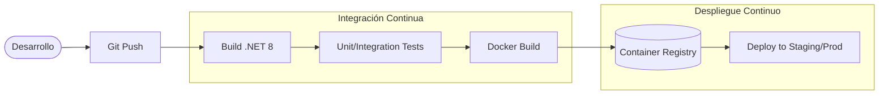

# 5. Infraestructura y Estrategia de Despliegue

Aunque el ecosistema de microservicios actualmente se ejecuta en un entorno de desarrollo local, la arquitectura fue diseñada bajo los principios de **Aplicaciones Nativas de la Nube (Cloud-Native)** y la metodología **Twelve-Factor App**. Esto garantiza que el sistema sea fácilmente portable, escalable y preparado para un despliegue en entornos productivos.

---

## 5.1 Infraestructura como Código (Docker Compose)

Para garantizar la reproducibilidad del entorno y evitar el clásico problema de *"funciona en mi máquina"*, la capa de persistencia y mensajería se encuentra completamente contenerizada. 

Se utiliza un archivo de orquestación local que aprovisiona todos los servicios de infraestructura necesarios con un solo comando (`docker-compose up -d`), estableciendo redes aisladas y volúmenes persistentes.

### Decisiones de Diseño en la Infraestructura Local:
* **Aislamiento de Red:** Todos los servicios operan dentro de una red de tipo bridge (`ecommerce_network`), impidiendo el acceso externo no autorizado y permitiendo la resolución de nombres por DNS interno de Docker.
* **Optimización de Imágenes:** Se prioriza el uso de distribuciones `alpine` (ej. `postgres:15-alpine`, `redis:7-alpine`) para reducir drásticamente la superficie de ataque y el peso de los contenedores.
* **Bootstrapping de Bases de Datos:** Se utiliza un volumen que inyecta el script `init-multiple-dbs.sql` en el *entrypoint* de PostgreSQL. Esto permite que, al levantar el contenedor por primera vez, se aprovisionen automáticamente las bases de datos lógicas separadas (`auth_db`, `pedidos_db`, `inventario_db`), respetando el patrón *Database-per-Service* sin necesidad de intervención manual.

<details>
<summary><b>Ver Archivo docker-compose.yml</b></summary>

```yaml
version: '3.8'

services:
  rabbitmq:
    image: rabbitmq:3-management-alpine
    container_name: ecommerce_rabbitmq
    ports:
      - "5672:5672" 
      - "15672:15672" 
    environment:
      RABBITMQ_DEFAULT_USER: guest
      RABBITMQ_DEFAULT_PASS: guest
    networks:
      - ecommerce_network

  redis:
    image: redis:7-alpine
    container_name: ecommerce_redis
    ports:
      - "6379:6379"
    networks:
      - ecommerce_network

  postgres:
    image: postgres:15-alpine
    container_name: ecommerce_postgres
    environment:
      POSTGRES_USER: admin
      POSTGRES_PASSWORD: Password123!
    ports:
      - "5432:5432"
    volumes:
      - postgres_data:/var/lib/postgresql/data
      - ./init-multiple-dbs.sql:/docker-entrypoint-initdb.d/init-multiple-dbs.sql
    networks:
      - ecommerce_network

networks:
  ecommerce_network:
    driver: bridge

volumes:
  postgres_data:
```
</details>

---

## 5.2 Gestión de Configuración y Secretos

En preparación para entornos productivos, el código fuente no contiene credenciales *hardcodeadas*. 
* **Desarrollo Local:** Las cadenas de conexión, claves de encriptación JWT y configuraciones de RabbitMQ/Redis se inyectan a través de los archivos `appsettings.json` o `appsettings.Development.json`.
* **Producción:** La arquitectura está preparada para que estos valores sean sobrescritos mediante **Variables de Entorno** a nivel del contenedor, o integrados con gestores de secretos corporativos (como Azure Key Vault o AWS Secrets Manager).

---

## 5.3 Pipeline Propuesto de Integración y Despliegue Continuo (CI/CD)

Si bien la ejecución actual es local, el diseño de los repositorios y la separación de dominios facilita la implementación de pipelines automatizados (ej. GitHub Actions, Azure DevOps). El flujo de trabajo estándar propuesto para escalar el proyecto hacia un entorno Cloud (como Azure Container Apps o Amazon ECS) sería el siguiente:


* **Ventaja del Ecosistema:** Al tener microservicios independientes, una actualización en la lógica de `Api.Inventario` dispara únicamente el pipeline de dicho servicio, permitiendo despliegues ágiles sin afectar la disponibilidad del resto del sistema.


## 5.4 Escalabilidad y Preparación para Orquestadores (Kubernetes / K8s)

El ecosistema fue rigurosamente codificado respetando el principio **Stateless** (sin estado local), lo que significa que la infraestructura está lista para ser migrada desde un entorno estático (Docker Compose) hacia un orquestador dinámico en la nube como Kubernetes (K8s) o Amazon ECS.

Esta preparación arquitectónica habilita los siguientes comportamientos corporativos:

* **Escalado Automático (HPA):** Un orquestador puede monitorear el consumo de CPU de `Api.Inventario` y levantar múltiples réplicas del contenedor automáticamente ante un pico de demanda, destruyéndolas cuando el tráfico baje.
* **Patrón Competing Consumers:** Al levantar múltiples instancias de un mismo microservicio, todas escuchan la misma cola en RabbitMQ. El Message Broker distribuirá automáticamente la carga de eventos de forma equitativa (Round-Robin) entre todos los contenedores disponibles, multiplicando la capacidad de procesamiento del sistema.
* **Consistencia Distribuida del Gateway:** Dado que YARP utiliza Redis como almacén externo para el Rate Limiting y la Caché, el Gateway puede escalar a "N" instancias. Si una IP maliciosa es bloqueada por la Instancia 1, la Instancia 2 compartirá esa información en tiempo real a través de Redis, manteniendo el cerco de seguridad perimetral intacto en toda la red.


---

| <b><a href="./03-api-gateway.md">Anterior: API Gateway (YARP)</a></b> | <b><a href="../README.md">Volver al Inicio</a></b> |
| :--- | ---: |